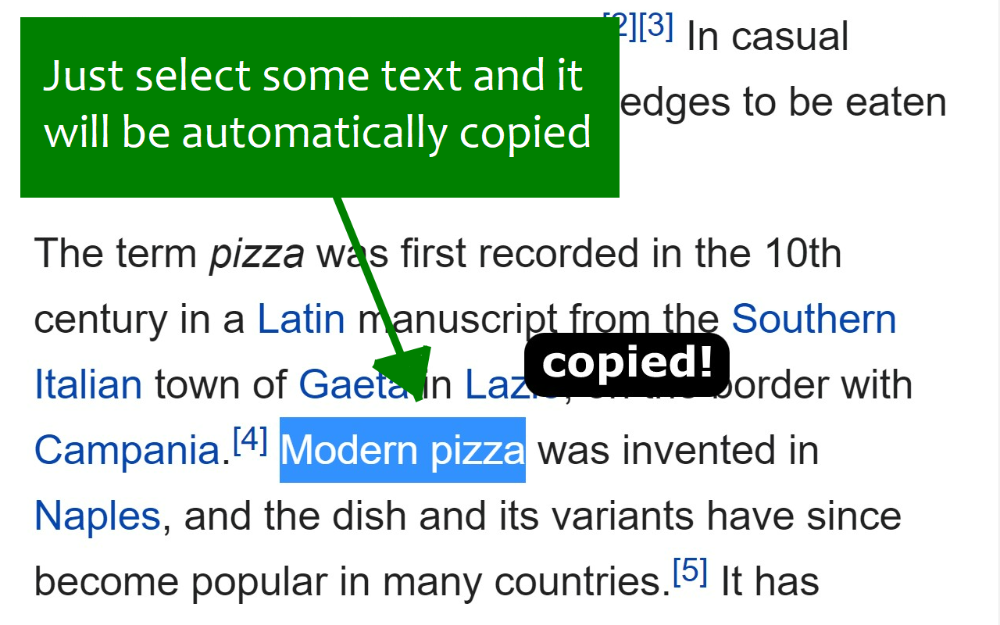
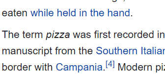
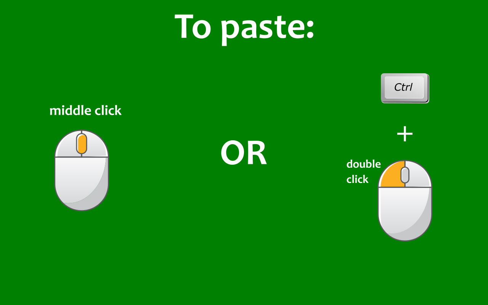
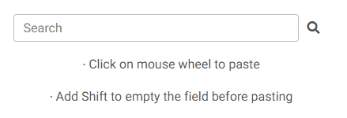
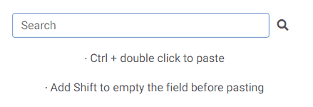

# Copy on Select

This Chrome extension will let you select any text in a web page and have it **automatically copied to the clipboard**. 

 

  <!--  -->
  

 

You can also **quickly paste** the copied text by clicking on the mouse wheel, or by double clicking the left mouse button while keeping the Ctrl key pressed.  
If you keep the Shift key pressed while pasting, the field into which you are pasting will be emptied of all already existing text before pasting.

 

  
   &nbsp;&nbsp;
  
Pasting with middle click:

  
   &nbsp;&nbsp;
  
Pasting with Ctrl + double click:

  

 

<!--  

  

   --> 
  
&nbsp;  

## Stack used:

HTML, CSS, Javascript (Extensions APIs)

&nbsp;
  
### Chrome Web Store link: 

https://chrome.google.com/webstore/detail/copy-on-select/kdfngfkkopeoejecmfejlcpblohnbael
